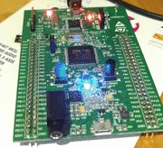

# STM32F4 Discovery board project template

This is a project template for the [STM32F4 Discovery board](http://www.st.com/web/catalog/tools/FM116/SC959/SS1532/PF252419),
a development and evaluation board for a popular ARM microcontroller.

It should also be able to be adapted for use with any microcontroller from the STM32F4 series, although you may need to alter some configuration options.

It contains:

* a working toolchain for building and flashing software

* in `libs`, the [STM32F4 DSP and standard peripherals library](http://www2.st.com/content/st_com/en/products/embedded-software/mcus-embedded-software/stm32-embedded-software/stm32-standard-peripheral-libraries/stsw-stm32065.html),
  which has two main parts:

  * a set of header files with lots of useful constants (eg. registers defined by name)
  * a set of device drivers that abstract away some of the low-level hardware details

  The header files are quite useful, but I have mixed feelings about the device drivers. They do have some useful constants, and anything you don't use will be
  optimised out out of the final flash image.

* in `main`, a sample application that will flash the LEDs in a pattern to demonstrate everything is working OK:

  

This is a work in progress, but it should be ready for use. Please feel free to submit ideas, suggestions, issue reports and pull requests.

## Requirements

* [stlink](https://github.com/texane/stlink) - `brew install stlink` on OS X
* [CMake](http://cmake.org) - `brew install cmake` on OS X
* [GCC ARM toolchain](https://launchpad.net/gcc-arm-embdded) - `brew install gcc-arm-none-eabi-49` on OS X

I haven't tested this on anything other than OS X. There's no reason I know of that would prevent it from working on Linux.
Windows might be a bit more challenging though :)

## Setup
You should only need to run this once to set up the makefile:

```bash
stm32f4-project-template $ mkdir build
stm32f4-project-template $ cd build
stm32f4-project-template/build $ cmake -DCMAKE_TOOLCHAIN_FILE=../toolchain-arm-none-eabi.cmake ..
```

## Building

```bash
# In the build/ directory created in 'Setup' above
stm32f4-project-template/build $ make
```

Note that if you add or remove any source code files, you'll need to run `cmake ..` again to get it to regenerate the makefile.
(This is because I'm using globbing and CMake [doesn't support detecting changes when using globbing](https://cmake.org/cmake/help/v3.3/command/file.html?highlight=We+do+not+recommend+using+GLOB).
If this annoys you, the alternative is to specify each file individually in the appropriate `CMakeLists.txt` file. I find globbing the lesser of two evils.)

## Flashing firmware
Connect the board to your computer with a USB-to-mini-USB cable (use the port at the top of the board, away from the buttons and audio jack -
the micro USB port at the front of the board is not for programming), then run:

```bash
# In the build/ directory created in 'Setup' above
stm32f4-project-template/build $ make flash_firmware
```

## Tips / gotchas

### IRQ handler isn't being executed

* Make sure your handler matches the name given in `stm32f407vg.S`.

* If your handler is in a C++ file, make sure it is compiled with C linkage (see [this Wikipedia page](https://en.wikipedia.org/wiki/Compatibility_of_C_and_C%2B%2B#Linking_C_and_C.2B.2B_code) for an explanation of why this is necessary).

  This means you should wrap your IRQ handler in `extern "C"`, like this:

  ```cpp
  extern "C" {
    void MyReallyCool_IRQHandler() {

    }
  }
  ```

## Acknowledgements and references

* [ST's STM32F4 DSP and standard peripherals library](http://www2.st.com/content/st_com/en/products/embedded-software/mcus-embedded-software/stm32-embedded-software/stm32-standard-peripheral-libraries/stsw-stm32065.html)

* [ST's clock configuration tool](http://www2.st.com/content/st_com/en/products/development-tools/software-development-tools/stm32-software-development-tools/stm32-configurators-and-code-generators/stsw-stm32091.html)
  for generating `system_stm32f4xx.c`

* [https://github.com/adrienbailly/STM32-CMake-CodeSourcery/blob/master/CMakeLists.txt](https://github.com/adrienbailly/STM32-CMake-CodeSourcery/blob/master/CMakeLists.txt) for CMake snippets

* [http://tech.munts.com/MCU/Frameworks/ARM/stm32f4/](http://tech.munts.com/MCU/Frameworks/ARM/stm32f4/) for linker script and startup assembler

* [http://stackoverflow.com/a/20805828/1668119](http://stackoverflow.com/a/20805828/1668119) for compiler flags

* [http://simplemachines.it/doc/arm_inst.pdf](http://simplemachines.it/doc/arm_inst.pdf) for ARM instruction set (useful when tweaking startup assembly)

* [http://jeremyherbert.net/get/stm32f4_getting_started](http://jeremyherbert.net/get/stm32f4_getting_started) for pointers to some useful documentation and examples of how to use the GPIOs and timers

## Contributing

Any suggestions and pull requests welcome.
